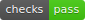
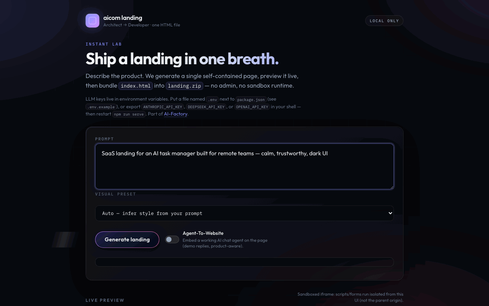
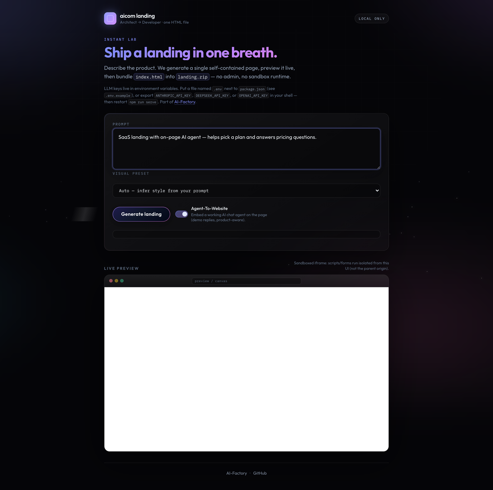

<!-- aicom-mirror-notice -->
> **📖 Read-only mirror.** `aicom-landing` is published from the canonical AI-Factory monorepo.
> **Pull requests are not accepted** — any commit pushed here is overwritten by
> `scripts/mirror_satellites.sh` on the next sync.
> 🐞 Found a bug or have a request? Please **[open an issue](https://github.com/alexar76/aicom-landing/issues)**.

# AI landing generator

<!-- aicom-readme-badges -->
<p align="center">
  <a href="https://github.com/alexar76/aicom-landing/actions/workflows/ci.yml"></a>
  <a href="docs/badges/coverage.svg"></a>
  <a href="LICENSE"></a>
</p>
<!-- /aicom-readme-badges -->


**MIT · one prompt → one self-contained HTML landing in ~30–60 seconds.**

<p align="center">
  
</p>

> ## ▶ [Open the live generator](https://magic-ai-factory.com/landing-page-generation/)
>
> **Try it in the browser** — enter a prompt, pick a style, generate, preview, download `landing.zip`.  
> Part of the **[AI-Factory](https://magic-ai-factory.com/)** ecosystem · [GitHub](https://github.com/alexar76/aicom-landing) · [AI-Factory source](https://github.com/alexar76/aicom)

A fast, self-hosted page generator. Two LLM agents — **Architect** (structure + visual plan) → **Developer** (single HTML file) — plus **20** style presets. No admin panel, no database, no QA pipeline: ideal for MVPs, A/B copy, and “ship the landing today” workflows.

| | **AI landing generator** | **[AI-Factory](https://magic-ai-factory.com/)** |
|---|-------------------|------------------|
| **Time** | ~30–120 s | >30 min |
| **Output** | One `index.html` (+ optional ZIP) | Full product + gates |
| **Best for** | Landing hypothesis, marketing experiments | Production software |

**API (hosted):** `POST` [`https://magic-ai-factory.com/landing-page-generation/api/generate`](https://magic-ai-factory.com/landing-page-generation/api/generate) — JSON body; send `Origin` / `Referer` for the same host (not a GET link in the browser). Optional: `"agent_to_website": true` — see [`docs/AGENT-TO-WEBSITE.md`](docs/AGENT-TO-WEBSITE.md).

---

## Screenshots

### Generator UI (local preview)

Type a product brief, pick a visual preset (or Auto), optionally enable **Agent-To-Website** (embedded demo chat on the page), generate, preview in-page, download `landing.zip`.



```bash
npm run serve
# → http://127.0.0.1:3847/
```

UI languages: **en** (default), **ru**, **es** — set `AICOM_LANDING_UI_LOCALE=en` in `.env`, or open `?lang=ru` for a one-off switch. Sample prompts: [`docs/PROMPTS.md`](docs/PROMPTS.md).

---

## Example landings (generated with this repo)

Real outputs from the CLI (DeepSeek, May 2026). Each file is **one HTML document** with an embedded **demo AI agent** (chat open in screenshots) — open locally or host anywhere static.

### 1 · SaaS task manager · `midnight-terminal`

**Prompt:** *SaaS landing for an AI task manager built for remote teams — calm, trustworthy, dark command-center UI with clear pricing.*


→ [Open `docs/examples/saas-task-manager.html`](docs/examples/saas-task-manager.html)

### 2 · Fintech payments · `luxe-gold-obsidian`

**Prompt:** *Fintech app for cross-border payments for freelancers — trust, speed, premium dark UI.*


→ [Open `docs/examples/fintech-payments.html`](docs/examples/fintech-payments.html)

### 3 · Home solar · `sage-organic`

**Prompt:** *Green energy startup landing for home solar panels — warm, optimistic, organic wellness aesthetic.*


→ [Open `docs/examples/green-solar.html`](docs/examples/green-solar.html)

Regenerate or add your own:

```bash
node cli.mjs "Your product pitch" --style aurora-glass --out docs/examples/my-landing.html
npx aicom-landing --list-styles
```

More detail: [`docs/examples/README.md`](docs/examples/README.md).

---

## Quick start

**Requirements:** Node.js **18+** (native `fetch`). One LLM provider:

- `ANTHROPIC_API_KEY`, or
- **`DEEPSEEK_API_KEY`** (recommended if OpenAI is region-blocked), or
- `OPENAI_API_KEY`, or
- local **Ollama** (`OLLAMA_HOST` / `OLLAMA_MODEL`)

```bash
cd aicom-landing
cp .env.example .env          # add your API key
npm run serve                 # web UI on :3847
```

**CLI** (writes `output/index.html` by default):

```bash
npx aicom-landing "SaaS landing for an AI task manager for remote teams"
npx aicom-landing "Green energy startup" --style sage-organic --out ./dist/page.html
npx aicom-landing "Florist with on-page AI guide" --agent
```

Keys and `AICOM_LANDING_UI_LOCALE` load from `.env` at startup (`.env` overrides shell exports). Provider choice and models: [**LLM providers**](#llm-providers) below.

---

## LLM providers

There is **no provider toggle in the UI** — the server picks the first configured cloud key, otherwise Ollama. Routing lives in [`llm/provider.js`](llm/provider.js).

### Where API keys live

| Environment | File / location |
|-------------|-----------------|
| **Local** (`npm run serve`, CLI) | `.env` next to `package.json` (copy from [`.env.example`](.env.example); **never commit** — listed in `.gitignore`) |
| **Docker** | Host `./.env`, mounted via `env_file:` in [`docker-compose.yml`](docker-compose.yml) |
| **Production (VPS)** | e.g. `/opt/aicom-landing/.env` on the server — **separate** from your laptop; edit on the host, then `docker compose up -d --build` |

Keys are read only on the **server** (Architect → Developer pipeline). The browser never sees `DEEPSEEK_API_KEY` or other secrets.

After changing `.env`, restart the process (`npm run serve` or recreate the container).

### Which provider is used (priority)

| Order | If this env var is set | Default model | Optional model override |
|------:|------------------------|---------------|-------------------------|
| 1 | `ANTHROPIC_API_KEY` | `claude-sonnet-4-6` | `ANTHROPIC_MODEL` |
| 2 | `DEEPSEEK_API_KEY` | `deepseek-chat` | `DEEPSEEK_MODEL`, `DEEPSEEK_BASE_URL` (default `https://api.deepseek.com/v1`) |
| 3 | `OPENAI_API_KEY` | `gpt-4o-mini` | `OPENAI_MODEL`, `OPENAI_BASE_URL` (Groq / other OpenAI-compatible APIs) |
| 4 | *(none of the above)* | Ollama | `OLLAMA_HOST` (default `http://127.0.0.1:11434`), `OLLAMA_MODEL` (default `llama3.2`) |

**DeepSeek only:** set `DEEPSEEK_API_KEY` and leave `ANTHROPIC_API_KEY` / `OPENAI_API_KEY` unset (or commented out) in `.env`.

**Example `.env` (DeepSeek):**

```bash
DEEPSEEK_API_KEY=sk-...
# DEEPSEEK_MODEL=deepseek-chat
# DEEPSEEK_BASE_URL=https://api.deepseek.com/v1
AICOM_LANDING_UI_LOCALE=ru
```

### Generation tuning (optional)

| Variable | Default | Purpose |
|----------|---------|---------|
| `AICOM_LANDING_JSON_RETRIES` | `3` | Retries per stage when model JSON is malformed or truncated |
| `AICOM_LANDING_FETCH_RETRIES` | `3` | Retries for transient LLM HTTP/network errors |

Architect / Developer output token caps are fixed in code (**8192** / **16384**). Troubleshooting JSON errors: [`docs/DEPLOY.md`](docs/DEPLOY.md#troubleshooting-invalid-json-architect--developer).

---

## Configuration

| Variable | Default | Purpose |
|----------|---------|---------|
| `AICOM_LANDING_HOST` | `127.0.0.1` | Preview server bind |
| `AICOM_LANDING_PORT` / `PORT` | `3847` | Preview server port |
| `AICOM_LANDING_UI_LOCALE` | `en` | UI + fallback landing language (`en` \| `ru` \| `es`) |
| `AICOM_LANDING_BADGE_ENABLED` | `true` | Footer “Powered by” pill on generated pages |
| `AICOM_LANDING_BADGE_URL` | `https://magic-ai-factory.com/` | Badge link |
| `AICOM_LANDING_BADGE_LABEL` | `Powered by AI-Factory` | Badge text |
| `AICOM_LANDING_RATE_LIMIT` | `20` | Max `POST /api/generate` per client IP per 15 minutes (`0` = off) |
| `AICOM_LANDING_TRUST_PROXY` | *(unset)* | Set to `true` only behind your own reverse proxy so rate limits honor `X-Forwarded-For` safely |
| `AICOM_LANDING_BASE_PATH` | *(empty)* | Browser URL prefix when the app is not at domain root (e.g. `/landing-page-generation`). Prefer a **subdomain** instead — see [`docs/DEPLOY.md`](docs/DEPLOY.md). |
| `AICOM_LANDING_AGENT_STRICT` | *(on)* | Replace LLM agent widget if risky JS detected (`false` to disable) |
| `AICOM_LANDING_SKIP_AGENT_INJECT` | *(off)* | `true` = never inject safe fallback widget |

**Agent-To-Website:** [`docs/AGENT-TO-WEBSITE.md`](docs/AGENT-TO-WEBSITE.md) — embedded chat, demo mode, security model.

**Production / reverse proxy:** see [`docs/DEPLOY.md`](docs/DEPLOY.md) (subdomain recommended, TLS, nginx).

The badge is **injected after generation** (`lib/badgeConfig.mjs`), not left to the LLM — so URL/label stay exact. When the page includes **`#aicom-agent`** (Agent-To-Website), the badge is placed **left of the chat FAB** (`bottom: 0.625rem`, `right: 5.85rem`) so it does not cover the button.

**Generation limits (built-in):** Architect uses up to **8192** output tokens; Developer up to **16384**. Malformed or truncated JSON is retried (`AICOM_LANDING_JSON_RETRIES`, default **3**). See [`docs/DEPLOY.md`](docs/DEPLOY.md#troubleshooting-invalid-json-architect--developer).

**Security:** the preview iframe uses **`sandbox`** (scripts/forms only; **no `allow-same-origin`**) so generated JS cannot read this UI’s cookies or DOM. Responses add **CSP** on the shell page and on `/preview/:id`. Still treat LLM output as untrusted: host behind auth/TLS on anything beyond a personal machine.

| Concern | Mitigation |
|--------|------------|
| Preview / ZIP payload | Session IDs are unguessable + TTL; CSP on preview; iframe sandbox isolates the parent UI |
| CSRF on `POST /api/generate` | `Origin` / `Referer` hostname must match `Host` hostname (default ports like `:443` / `:80` ignored so TLS proxies work) |
| Abuse / cost | Optional rate limit: `AICOM_LANDING_RATE_LIMIT` (default **20** POSTs per IP per **15** min; `0` disables) |
| Agent widget JS | Strict audit + safe fallback; demo chat does not call your LLM — [`docs/AGENT-TO-WEBSITE.md`](docs/AGENT-TO-WEBSITE.md) |

Programmatic `POST /api/generate` from non-browser tools must send `Origin` or `Referer` whose **hostname** matches the request `Host` hostname (e.g. `-H "Origin: http://127.0.0.1:3847"`).

---

## Docker

Build once; pass secrets at **run** time only (never bake keys into the image). Put keys in **`.env` on the host** and pass `--env-file .env` (or use Compose below) so they **survive container restart/recreate** — see [`docs/DEPLOY.md`](docs/DEPLOY.md).

The image sets **`AICOM_LANDING_HOST=0.0.0.0`** so the process listens on all interfaces (unlike the default `127.0.0.1` when run with Node locally). There is **no authentication** and **no HTTPS** inside the container — expose it only on trusted networks or put **TLS + auth** (reverse proxy, VPN, etc.) in front. The process runs as a **non-root** user inside the image (`uid 1001`).

```bash
cp .env.example .env   # DEEPSEEK_API_KEY, AICOM_LANDING_UI_LOCALE=en, …

# Preview UI (Compose — env persists on host)
docker compose up -d --build

# Or one-off / manual
docker build -t aicom-landing .
docker run --rm -p 3847:3847 --env-file ./.env \
  --entrypoint node aicom-landing /app/preview-server.mjs

# CLI one-shot
docker run --rm --env-file ./.env -v "$PWD/out:/out" aicom-landing \
  "Fintech app for freelancers" --out /out/index.html

# Disable badge / custom label
docker run --rm -p 3847:3847 \
  -e DEEPSEEK_API_KEY \
  -e AICOM_LANDING_BADGE_ENABLED=false \
  --entrypoint node aicom-landing /app/preview-server.mjs
```

---

## How it works

```
User prompt + style preset
        ↓
   Architect (JSON: layout, copy language, visual plan, sections)
        ↓
   Developer (single HTML: embedded CSS, inline SVG, optional JS)
        ↓
   Badge inject (env) → preview / ZIP / disk
```

- **20 presets** in `styles/presets.json` (glass, brutalist, editorial, organic, cyberpunk, …).
- **Landing copy language** follows the prompt; if unclear, uses `ui_locale` from the UI (not English by default).
- **Funnel:** optional footer CTA to [magic-ai-factory.com](https://magic-ai-factory.com/) when the badge is enabled.

---

## Community

- [License](LICENSE) (MIT)
- [Code of conduct](CODE_OF_CONDUCT.md)
- [Contributing](CONTRIBUTING.md)
- [Security policy](SECURITY.md)

---

## Repo layout

```
aicom-landing/
├── cli.mjs                 # CLI entry
├── preview-server.mjs      # Web UI + /api/generate + preview + zip
├── public/index.html       # Generator UI
├── lib/
│   ├── generate.mjs        # Architect → Developer pipeline
│   ├── agentToWebsite.mjs  # Agent-To-Website widget + security audit
│   ├── badgeConfig.mjs     # Powered-by env + HTML inject
│   ├── uiLocale.mjs        # UI strings (en / ru / es)
│   └── …
├── llm/                    # provider + prompts
├── styles/presets.json
├── docs/
│   ├── AGENT-TO-WEBSITE.md # Embedded agent mode + security
│   ├── screenshots/        # README images
│   └── examples/           # Sample generated landings
└── Dockerfile
```

See [Contributing](CONTRIBUTING.md) for how to propose changes.

---

## License

This project is released under the [MIT License](LICENSE).
