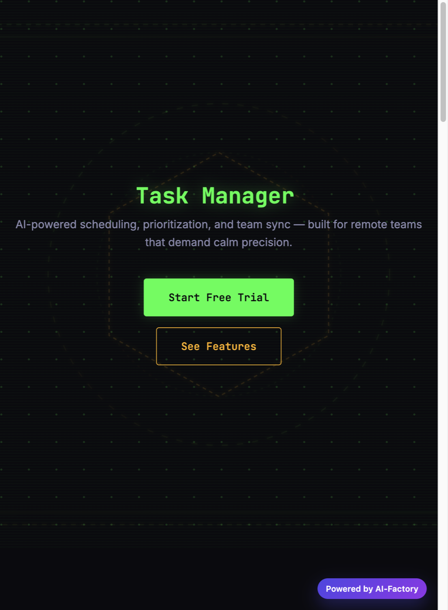
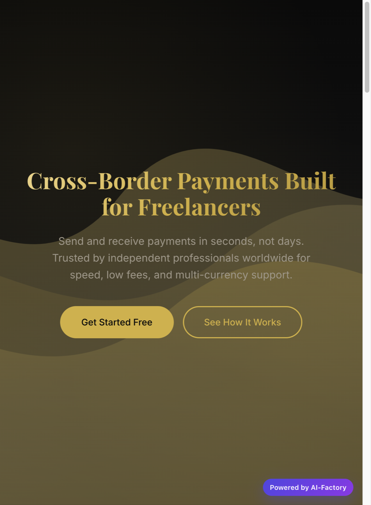
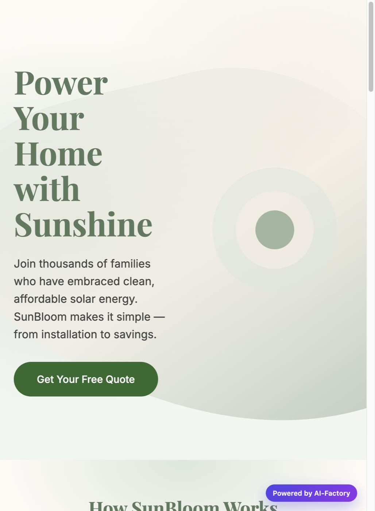

# aicom landing

**MIT · one prompt → one self-contained HTML landing in ~30–60 seconds.**

A fast, self-hosted page generator in the **[AI-Factory](https://magic-ai-factory.com/)** ecosystem ([source: github.com/alexar76/aicom](https://github.com/alexar76/aicom)). Two LLM agents — **Architect** (structure + visual plan) → **Developer** (single HTML file) — plus **20** style presets. No admin panel, no database, no QA pipeline: ideal for MVPs, A/B copy, and “ship the landing today” workflows.

| | **aicom landing** | **[AI-Factory](https://magic-ai-factory.com/)** |
|---|-------------------|------------------|
| **Time** | ~30–60 s | ~10–30 min |
| **Output** | One `index.html` (+ optional ZIP) | Full product + gates |
| **Best for** | Landing hypothesis, marketing experiments | Production software |

---

## Screenshots

### Generator UI (local preview)

Type a product brief, pick a visual preset (or Auto), generate, preview in-page, download `landing.zip`.


```bash
npm run serve
# → http://127.0.0.1:3847/
```

UI languages: **en**, **ru**, **es** — set `AICOM_LANDING_UI_LOCALE` or open `?lang=ru`.

---

## Example landings (generated with this repo)

Real outputs from the CLI (DeepSeek, May 2026). Each file is **one HTML document** — open locally or host anywhere static.

### 1 · SaaS task manager · `midnight-terminal`

**Prompt:** *SaaS landing for an AI task manager built for remote teams — calm, trustworthy, dark command-center UI with clear pricing.*

[](docs/examples/saas-task-manager.html)

→ [Open `docs/examples/saas-task-manager.html`](docs/examples/saas-task-manager.html)

### 2 · Fintech payments · `luxe-gold-obsidian`

**Prompt:** *Fintech app for cross-border payments for freelancers — trust, speed, premium dark UI.*

[](docs/examples/fintech-payments.html)

→ [Open `docs/examples/fintech-payments.html`](docs/examples/fintech-payments.html)

### 3 · Home solar · `sage-organic`

**Prompt:** *Green energy startup landing for home solar panels — warm, optimistic, organic wellness aesthetic.*

[](docs/examples/green-solar.html)

→ [Open `docs/examples/green-solar.html`](docs/examples/green-solar.html)

Regenerate or add your own:

```bash
node cli.mjs "Your product pitch" --style aurora-glass --out docs/examples/my-landing.html
npx aicom-landing --list-styles
```

More detail: [`docs/examples/README.md`](docs/examples/README.md).

---

## Quick start

**Requirements:** Node.js **18+** (native `fetch`). One LLM provider:

- `ANTHROPIC_API_KEY`, or
- **`DEEPSEEK_API_KEY`** (recommended if OpenAI is region-blocked), or
- `OPENAI_API_KEY`, or
- local **Ollama** (`OLLAMA_HOST` / `OLLAMA_MODEL`)

```bash
cd aicom-landing
cp .env.example .env          # add your API key
npm run serve                 # web UI on :3847
```

**CLI** (writes `output/index.html` by default):

```bash
npx aicom-landing "SaaS landing for an AI task manager for remote teams"
npx aicom-landing "Green energy startup" --style sage-organic --out ./dist/page.html
```

Provider order (`llm/provider.js`): Anthropic → DeepSeek → OpenAI → Ollama. Keys load from `.env` at startup (existing shell env vars are not overwritten).

---

## Configuration

| Variable | Default | Purpose |
|----------|---------|---------|
| `AICOM_LANDING_HOST` | `127.0.0.1` | Preview server bind |
| `AICOM_LANDING_PORT` / `PORT` | `3847` | Preview server port |
| `AICOM_LANDING_UI_LOCALE` | `en` | UI + fallback landing language (`en` \| `ru` \| `es`) |
| `AICOM_LANDING_BADGE_ENABLED` | `true` | Footer “Powered by” pill on generated pages |
| `AICOM_LANDING_BADGE_URL` | `https://magic-ai-factory.com/` | Badge link |
| `AICOM_LANDING_BADGE_LABEL` | `Powered by AI-Factory` | Badge text |
| `AICOM_LANDING_RATE_LIMIT` | `20` | Max `POST /api/generate` per client IP per 15 minutes (`0` = off) |
| `AICOM_LANDING_TRUST_PROXY` | *(unset)* | Set to `true` only behind your own reverse proxy so rate limits honor `X-Forwarded-For` safely |


The badge is **injected after generation** (`lib/badgeConfig.mjs`), not left to the LLM — so URL/label stay exact.

**Security:** the preview iframe uses **`sandbox`** (scripts/forms only; **no `allow-same-origin`**) so generated JS cannot read this UI’s cookies or DOM. Responses add **CSP** on the shell page and on `/preview/:id`. Still treat LLM output as untrusted: host behind auth/TLS on anything beyond a personal machine.

| Concern | Mitigation |
|--------|------------|
| Preview / ZIP payload | Session IDs are unguessable + TTL; CSP on preview; iframe sandbox isolates the parent UI |
| CSRF on `POST /api/generate` | `Origin` / `Referer` must match `Host` |
| Abuse / cost | Optional rate limit: `AICOM_LANDING_RATE_LIMIT` (default **20** POSTs per IP per **15** min; `0` disables) |

Programmatic `POST /api/generate` from non-browser tools must send `Origin` or `Referer` matching the server `Host` (e.g. `-H "Origin: http://127.0.0.1:3847"`).

---

## Docker

Build once; pass secrets at **run** time only (never bake keys into the image).

The image sets **`AICOM_LANDING_HOST=0.0.0.0`** so the process listens on all interfaces (unlike the default `127.0.0.1` when run with Node locally). There is **no authentication** and **no HTTPS** inside the container — expose it only on trusted networks or put **TLS + auth** (reverse proxy, VPN, etc.) in front. The process runs as a **non-root** user inside the image (`uid 1001`).

```bash
docker build -t aicom-landing .

# Preview UI
docker run --rm -p 3847:3847 --env-file ./.env \
  --entrypoint node aicom-landing /app/preview-server.mjs

# CLI one-shot
docker run --rm --env-file ./.env -v "$PWD/out:/out" aicom-landing \
  "Fintech app for freelancers" --out /out/index.html

# Disable badge / custom label
docker run --rm -p 3847:3847 \
  -e DEEPSEEK_API_KEY \
  -e AICOM_LANDING_BADGE_ENABLED=false \
  --entrypoint node aicom-landing /app/preview-server.mjs
```

---

## How it works

```
User prompt + style preset
        ↓
   Architect (JSON: layout, copy language, visual plan, sections)
        ↓
   Developer (single HTML: embedded CSS, inline SVG, optional JS)
        ↓
   Badge inject (env) → preview / ZIP / disk
```

- **20 presets** in `styles/presets.json` (glass, brutalist, editorial, organic, cyberpunk, …).
- **Landing copy language** follows the prompt; if unclear, uses `ui_locale` from the UI (not English by default).
- **Funnel:** optional footer CTA to [magic-ai-factory.com](https://magic-ai-factory.com/) when the badge is enabled.

---

## Repo layout

```
aicom-landing/
├── cli.mjs                 # CLI entry
├── preview-server.mjs      # Web UI + /api/generate + preview + zip
├── public/index.html       # Generator UI
├── lib/
│   ├── generate.mjs        # Architect → Developer pipeline
│   ├── badgeConfig.mjs     # Powered-by env + HTML inject
│   ├── uiLocale.mjs        # UI strings (en / ru / es)
│   └── …
├── llm/                    # provider + prompts
├── styles/presets.json
├── docs/
│   ├── screenshots/        # README images
│   └── examples/           # Sample generated landings
└── Dockerfile
```

---

## License

MIT
